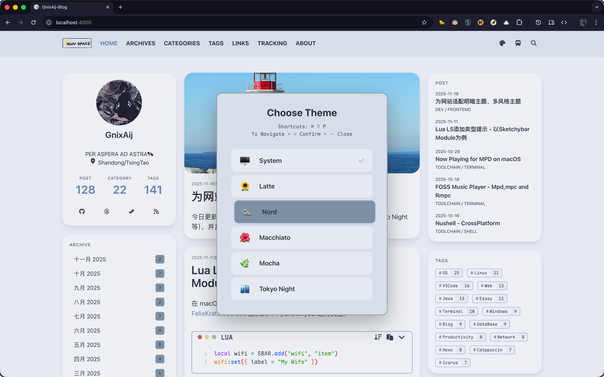
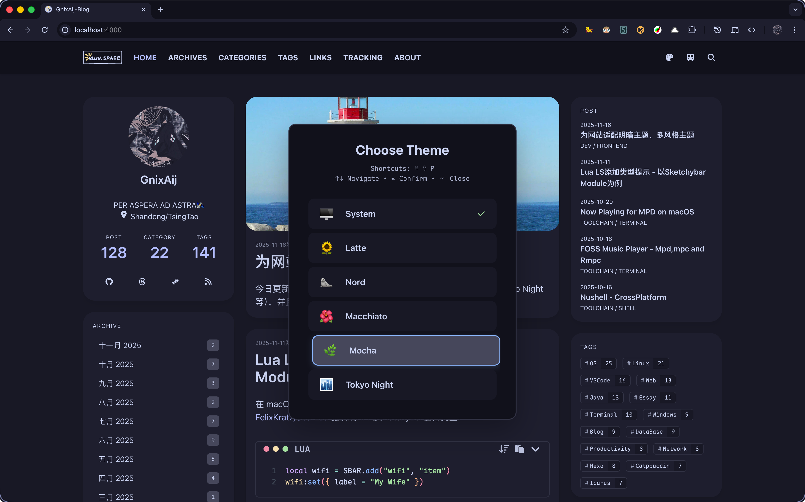
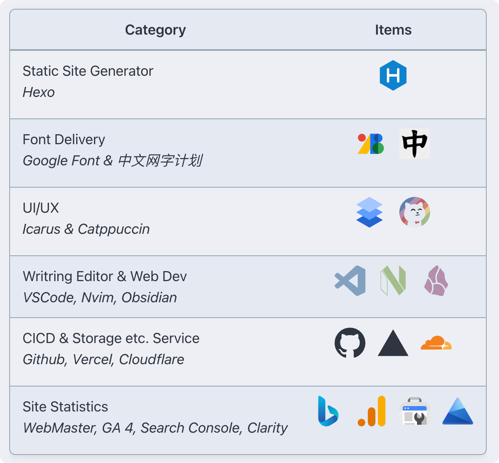
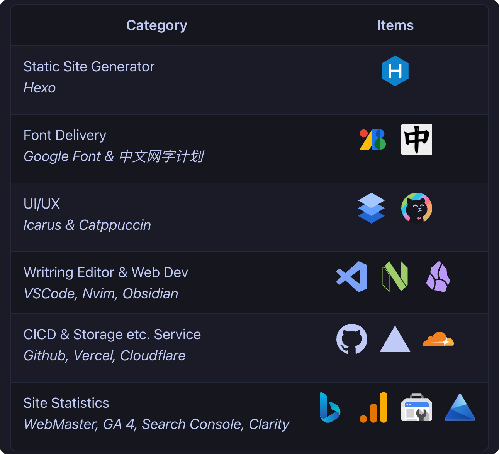
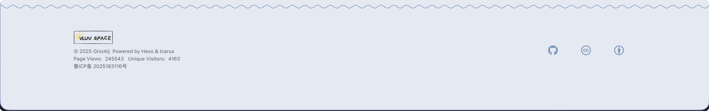
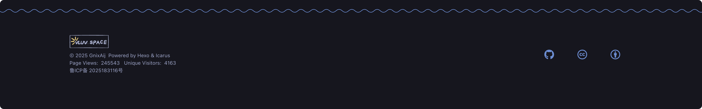

# Hexo Theme Icarus

## Demo & Preview

[vluv's space](https://vluv.space/)

### Multiple Theme Support

Support multiple light and dark themes:

- **System Theme**: Follow system theme automatically, use `Nord` for light mode and `Mocha` for dark mode by default
- **Light Themes**: `Nord`, `Cattpuccin Latte`
- **Dark Themes**: `Catppuccin Mocha`, `Catppuccin Macchiato`, `Tokyo Night`

|  |  |
| --------------------------- | ---------------------------- |

### Mermaid Filter [^2]

[^2]:
    Require [Efterklang/hexo-mermaid-diagram](https://github.com/Efterklang/hexo-mermaid-diagram)
    🚧 Dark mode WIP...


### Components

#### Table

|  |  |
| ---------------------------------------------- | ----------------------------------------------- |

#### Quote

|  |
| ----------------------------------------------- |
|   |

#### Footer

|  |
| ----------------------------------------------- |
|  |

## Installation

### Using git submodule(Recommended)

Using git submodule instead of bun add is recommended if you want to make any customizations to the theme

```shell
$ git submodule add https://github.com/Efterklang/hexo-theme-icarus themes/icarus
$ hexo config theme icarus
```

```diff package.json
{
  "dependencies": {
+   "hexo": "^7.2.0",
+   "hexo-cli": "^4.3.2",
+   "hexo-generator-archive": "^2.0.0",
+   "hexo-generator-category": "^2.0.0",
+   "hexo-generator-tag": "^2.0.0",
+   "hexo-log": "^4.1.0",
+   "hexo-pagination": "^3.0.0",
+   "hexo-renderer-inferno": "^1.0.2",
+   "hexo-renderer-stylus": "^3.0.1",
+   "hexo-server": "^3.0.0",
+   "hexo-shiki-highlight": "2.1.2",
+   "hexo-util": "^3.3.0",
+   "inferno": "^9.0.3",
+   "inferno-create-element": "^9.0.3",
+   "moment": "^2.30.1"
  }
}
```

### Using Bun

```shell
$ bun add git+https://github.com/Efterklang/hexo-theme-icarus
$ hexo config theme icarus
```

## Setup

<details>
<summary>Math Rendering Setup</summary>

To enable math rendering with optimized performance, use [markdown-it-mathjax3-pro](https://github.com/NeoNexusX/markdown-it-mathjax3-pro), which supports both SSR and CSR modes

</details>

<details>
<summary>Code Highlight Setup</summary>

Use [hexo-shiki-highlight](https://github.com/Efterklang/hexo-shiki-highlight) plugin for code block highlighting, support multiple themes as well;

Set `syntax_highlighter` to `shiki` in your hexo `_config.yml`:

```yaml _config.yml
# Syntax Highlighter
syntax_highlighter: shiki
```

|  |  |
| ----------------------------------------------------------------------------------------------------------------------------------- | ----------------------------------------------------------------------------------------------------------------------------------- |

</details>
